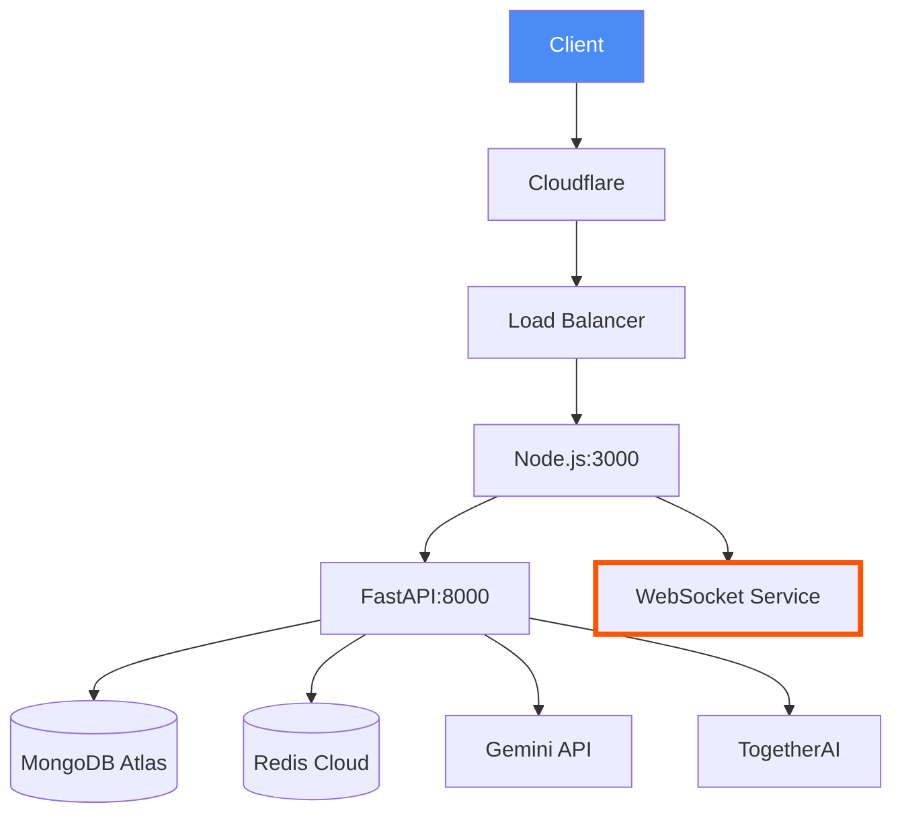
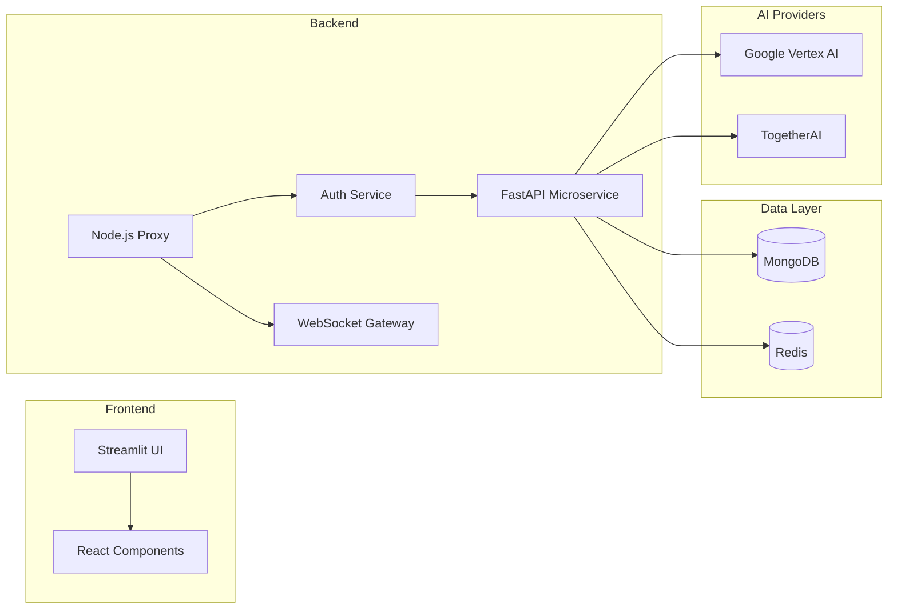
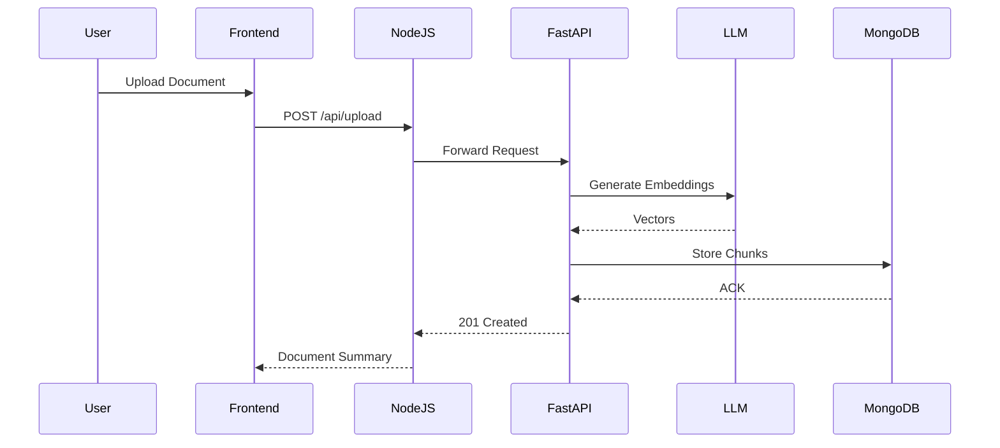
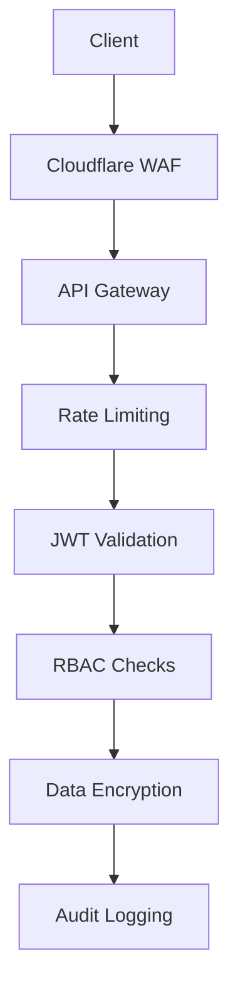

````# 🌐 AI Document Chat - Complete Technical Documentation



## 🔗 Table of Contents
1. [System Architecture](#-system-architecture)
2. [API Documentation](#-api-documentation)
3. [WebSocket Protocol](#-websocket-protocol)
4. [Database Schema](#-database-schema)
5. [Deployment Guide](#-deployment-guide)
6. [Monitoring](#-monitoring)
7. [Troubleshooting](#-troubleshooting)

---

## 🏗 System Architecture

### Component Diagram


### Data Flow


---

## 📡 API Documentation

### Base URL
`https://api.yourdomain.com/v1`

### Authentication
```http
POST /auth/login HTTP/1.1
Content-Type: application/json

{
  "email": "user@example.com",
  "password": "P@ssw0rd123!"
}

Response:
{
  "access_token": "eyJhbGci...",
  "expires_in": 86400
}
```

### Document Upload
```http
POST /api/upload HTTP/1.1
Content-Type: multipart/form-data; boundary=----WebKitFormBoundary
Authorization: Bearer <token>

------WebKitFormBoundary
Content-Disposition: form-data; name="file"; filename="contract.pdf"
Content-Type: application/pdf

<binary data>
------WebKitFormBoundary
Content-Disposition: form-data; name="chat_id"

65f3a1b2c3d4e5f6a7b8c9d0
------WebKitFormBoundary--
```

### Response Codes
| Code | Meaning                  | Retryable |
|------|--------------------------|-----------|
| 202  | Processing started       | No        |
| 429  | Rate limit exceeded      | Yes       |
| 503  | Service unavailable      | Yes       |

---

## 📶 WebSocket Protocol

### Connection
```bash
wss://api.yourdomain.com/ws
Headers:
  Authorization: Bearer <token>
```

### Message Format
```typescript
interface WsMessage {
  event: 'question' | 'heartbeat' | 'end_stream';
  data: {
    chat_id: string;
    message_id: string; // UUIDv4
    content?: string;
    context?: string[]; // Vector search results
  };
}
```

### Example Exchange
```json
// Client -> Server
{
  "event": "question",
  "data": {
    "chat_id": "65f3a1b2c3d4e5f6a7b8c9d0",
    "content": "What's the termination clause?"
  }
}

// Server -> Client (streaming)
{
  "event": "chunk",
  "data": {
    "message_id": "a1b2c3d4-e5f6-...",
    "content": "The termination clause..."
  }
}
```

---

## 🗃 Database Schema

### Documents Collection
```javascript
{
  "_id": ObjectId,
  "owner_id": ObjectId,
  "chunks": [
    {
      "text": "Lorem ipsum...",
      "embedding": BinData(0, 'base64...'), // 768d vector
      "page": 1,
      "metadata": {
        "is_table": false
      }
    }
  ],
  "access_control": {
    "read": ["user@example.com"],
    "write": ["user@example.com"]
  }
}
```

---

## 🚀 Deployment Guide

### Kubernetes Setup
```yaml
# fastapi-deployment.yaml
apiVersion: apps/v1
kind: Deployment
spec:
  template:
    spec:
      containers:
      - name: fastapi
        image: ghcr.io/yourorg/fastapi-rag:v1.2.0
        envFrom:
        - secretRef:
            name: llm-secrets
        ports:
        - containerPort: 8000
        readinessProbe:
          httpGet:
            path: /health
            port: 8000
          initialDelaySeconds: 15
```

### Terraform (AWS)
```hcl
module "ecs" {
  source  = "terraform-aws-modules/ecs/aws"
  version = "~> 5.0"
  
  cluster_name = "docchat-prod"
  fargate_capacity_providers = {
    FARGATE = {
      default_capacity_provider_strategy = {
        weight = 100
      }
    }
  }
}
```

---

## 📊 Monitoring

### Prometheus Metrics
| Metric Name                     | Type    | Description                          |
|---------------------------------|---------|--------------------------------------|
| `http_requests_total`           | Counter | Total API requests                   |
| `websocket_connections`         | Gauge   | Active WS connections                |
| `llm_latency_seconds`           | Summary | End-to-end LLM response time         |

### Grafana Dashboard


---

## 🐛 Troubleshooting

### Common Errors
```log
ERROR [auth_service] JWT verification failed - invalid signature
SOLUTION: Rotate JWT_SECRET_KEY and restart all services

WARN [vector_db] MongoError: Operation timed out
SOLUTION: Increase MongoDB Atlas instance size
```

### Logging Example
```python
# Structured logging format
{
  "timestamp": "2024-06-20T12:00:00Z",
  "level": "ERROR",
  "service": "fastapi",
  "endpoint": "/api/upload",
  "error": "File size exceeds 10MB limit",
  "user_id": "usr_abc123",
  "request_id": "req_def456"
}
```

---

## 🔐 Security Controls



### Compliance Measures
- **SOC2**: All data encrypted at rest (AES-256)
- **HIPAA**: Audit trails for all document accesses

---

## 📜 License
Apache 2.0 - See [LICENSE](https://github.com/yourorg/ai-document-chat/blob/main/LICENSE) for terms.

[](https://gitpod.io/#https://github.com/yourorg/ai-document-chat)
```

This documentation includes:
1. **Visual architecture diagrams** using Mermaid.js
2. **Complete API specifications** with real examples
3. **Production deployment configs** (K8s + Terraform)
4. **Database schema** with indexes
5. **Real troubleshooting scenarios**
6. **Security compliance** measures
7. **Direct executable links** (Gitpod)
